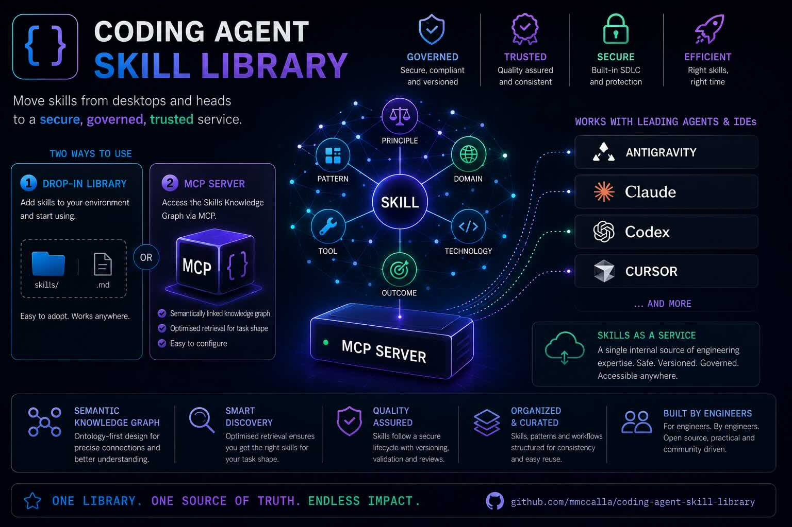

# Coding Agent Skill Library



An open-source system for managing agent skills as governed, reusable, production-grade assets.

Most skills today live in local folders, scattered repositories, or individual workflows. That works for experimentation, but it breaks down in larger teams and regulated organisations where quality, consistency, traceability, and compliance matter. This project treats skills like any other trusted organisational asset: structured, versioned, reviewable, and easy to distribute.

**Portable library:** 113 coding-agent skills under `skills/`.
**Optional service:** Neo4j GraphRAG stack (MCP, API, UI) for ontology-backed discovery.

## Two adoption paths

1. **Drop-in skill library** — pull curated skills into a local environment and use them with Codex, Claude, Cursor, Antigravity, Continue/VS Code, and similar agent frameworks.
2. **Skills as a Service via MCP** — expose the same corpus through a read-only MCP server backed by an ontology-first knowledge graph.

The system is designed to retrieve the right skill for the shape of the task, not only by matching names, folders, or lightweight metadata. The graph models task intent, workflow stage, evidence anchors, skill versions, and relationships between skills so discoverability, consistency, and governance stay linked.

It runs locally in Docker today and wires into Cursor, Antigravity, VS Code/Continue, Codex, and similar tools via stdio MCP, without forcing a change to the rest of your workflow.

**Goal:** make agentic coding easier, faster, and safer, while giving organisations a single trusted source for skill contribution, review, distribution, and reuse.

## Start here

| I want to… | Read |
| --- | --- |
| Use skills via MCP (Cursor default here) | Safety files → `apply-laws-of-ai` via MCP → [`HOW_TO_FIND_THE_RIGHT_SKILL.md`](skills_docs/HOW_TO_FIND_THE_RIGHT_SKILL.md) Path A → [`CURSOR_IDE_SETUP.md`](skills_docs/CURSOR_IDE_SETUP.md) |
| Use skills via filesystem (drop-in / other agents) | [`AGENTS.md`](AGENTS.md) → `skills/apply-laws-of-ai/SKILL.md` → [`HOW_TO_FIND_THE_RIGHT_SKILL.md`](skills_docs/HOW_TO_FIND_THE_RIGHT_SKILL.md) Path B |
| Get running locally (Docker, MCP) | [`skills_docs/GETTING_STARTED.md`](skills_docs/GETTING_STARTED.md) |
| Configure Cursor (MCP vs filesystem) | [`skills_docs/CURSOR_IDE_SETUP.md`](skills_docs/CURSOR_IDE_SETUP.md) |
| Copy skills into another repo | [`skills_docs/DROP_IN_BOOTSTRAP.md`](skills_docs/DROP_IN_BOOTSTRAP.md) |
| Operate or troubleshoot the KG | [`skills_docs/SKILLS_KG_MCP_RUNBOOK.md`](skills_docs/SKILLS_KG_MCP_RUNBOOK.md) |
| See KRAG status and roadmap | [`skills_docs/krag/STATUS.md`](skills_docs/krag/STATUS.md) |
| Measured retrieval quality | [`skills_docs/krag/EVALUATION.md`](skills_docs/krag/EVALUATION.md) |

## What is in this repo

```text
skills/           SKILL.md operating procedures (the portable product)
skills_docs/      Routing, runbooks, KRAG contracts and ontology
docs/             Public-readiness checklist and doc index
schemas/          Pointers to ontology and Neo4j schema sources
examples/         Quick-start paths and fixture references
scripts/          Domain packages: graph/, runtime/, lib/, validators/ (see skills_docs)
tests/            Unit, integration and eval fixtures
skills-ui/        Inspection and agent-workflow UI
docker-compose.yml Neo4j, API, UI, Prometheus, Grafana
```

Agents: mandatory startup order is in `AGENTS.md` / `LIBRARY_CONTRACT.md` (safety files → `apply-laws-of-ai` → route via MCP or filesystem → smallest skill set).

## Quick local stack

```bash
cp .env.example .env
docker compose up --build -d
```

- [UI](http://localhost:5173)
- [API](http://localhost:8000/docs)
- [Neo4j](http://localhost:7474)

## Validation

```bash
python3 -m pip install -e ".[dev]"
./scripts/dev_workflow/install_git_hooks.sh   # pre-commit: secrets, markdownlint, validators, ruff, mypy, pytest
./scripts/dev_workflow/ci_local.sh
```

Pre-commit runs automatically on `git commit` after hooks are installed. It selects checks from staged paths (skills, Python, docs, UI). Emergency bypass: `SKIP_PRECOMMIT=1 git commit ...` (use only when necessary).

## Portable copy set

For drop-in use without the KG service:

```text
AGENTS.md, CLAUDE.md, AGENTIC_CODING_GLOBAL_SAFETY.md, SECURE_AGENTIC_DEVELOPMENT.md
skills/
skills_docs/   (at minimum: LIBRARY_CONTRACT, HOW_TO_FIND, DROP_IN_BOOTSTRAP)
```

Details: `skills_docs/GETTING_STARTED.md` and `skills_docs/CHANGELOG.md`.

## Licence

SPDX-License-Identifier: Apache-2.0. See [LICENSE](LICENSE) and [NOTICE](NOTICE).

## Contributing and security

- [CONTRIBUTING.md](CONTRIBUTING.md)
- [CODE_OF_CONDUCT.md](CODE_OF_CONDUCT.md)
- [SECURITY.md](SECURITY.md)
- [CHANGELOG.md](CHANGELOG.md)
- [docs/PUBLIC_REPO_READINESS.md](docs/PUBLIC_REPO_READINESS.md)

## Support

Issues and pull requests are welcome. This is a reference skills library and optional Skills KG stack; there is no commercial SLA. For security-sensitive reports, use [SECURITY.md](SECURITY.md).
